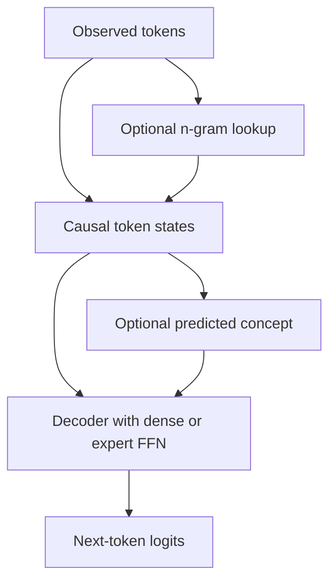

# Architecture proposal

Everything below is a project proposal, not a reported result or a faithful reproduction of a particular paper.

## Two routes

| Route | What it answers | Main cost | Decision |
| --- | --- | --- | --- |
| Train a small decoder with independently switchable MoE, NCP, and memory modules | Do the mechanisms work together and help at small scale? | Produces a research model with limited capability | Start here on the 5070 Ti |
| Adapt an existing capable model and introduce new modules gradually | Can the design retain and improve useful skills? | Compatibility, inherited training effects, more memory, substantial continued training | Revisit after the small experiments |

A lightweight adapter on an existing model may produce useful specialization sooner, but does not by itself create trained experts, concept prediction, or conditional memory. Architecture research and practical specialization should have separate success criteria.

## Initial prototype envelope

- Roughly 100–300M total parameters, counting embeddings, every expert, NCP modules, and memory tables. Final dimensions follow measured fit.
- Causal decoder with a fixed tokenizer shared across conditions. Preserve case and whitespace for code.
- Dense feedforward baseline, then four routed experts with top-1 routing as the first simple MoE condition. Keep all experts on GPU initially.
- Optional small n-gram table at a selected layer; initially use 2- and 3-token histories, deterministic hashes, contextual gating, and a strict byte cap. Case-preserving lookup is our proposed coding variant.
- Optional concept predictor with a small learned codebook. Implement and test a precisely defined causal alignment before tuning its size or loss weights.
- Start at context 512 and microbatch 1; explore context 1,024 after profiling. Use accumulation to control effective tokens per optimizer update.

The n-gram layer, router, and concept predictor have distinct responsibilities. The n-gram layer looks up local patterns; the router allocates neural computation; the concept predictor supplies a learned higher-level prediction. None implies that the model finishes thinking before emitting its first token.

## Proposed data flow

This diagram expresses responsibilities, not finalized layer placement. Training-only concept targets are deliberately outside the inference flow.

## Correctness contracts

1. **Causality:** changing future input tokens cannot change earlier logits. Future-derived concept targets may supervise a loss, but cannot be fed into current-token predictions. Inference uses only predicted concepts.
2. **Generation:** cached incremental decoding and full-prefix decoding agree within an explicit numerical tolerance, including at concept boundaries and n-gram state resets.
3. **Routing:** record expert usage, dropped-token count, and auxiliary losses. Do not silently discard overflow tokens. Count total and active parameters separately.
4. **Memory:** document hash functions, collisions, table dtype, and table optimizer behavior. Reset histories at document boundaries and never build a lookup corpus from held-out answers.
5. **Concept learning:** log code usage, entropy, reconstruction/prediction losses, and collapsed/dead codes. Specify target stop-gradient and update rules.
6. **Resumption:** checkpoints preserve model, optimizer, scheduler, scaler if used, RNG states, sampler position, data offset, tokenizer identity, and configuration.

Before implementation, settle the concept block width, shift, incomplete-prefix behavior, loss weights, routing capacity policy, memory parameter cap, and exact parameter counts. These are open design choices, not values supplied by the existing literature review.
