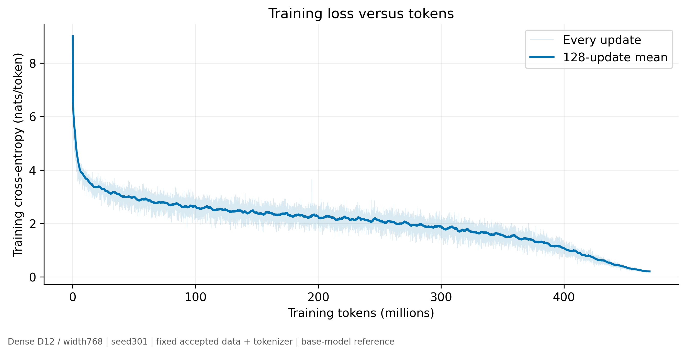
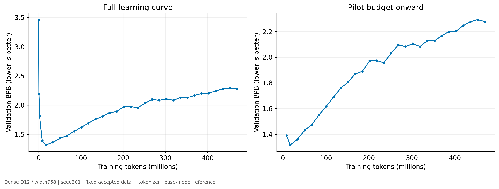
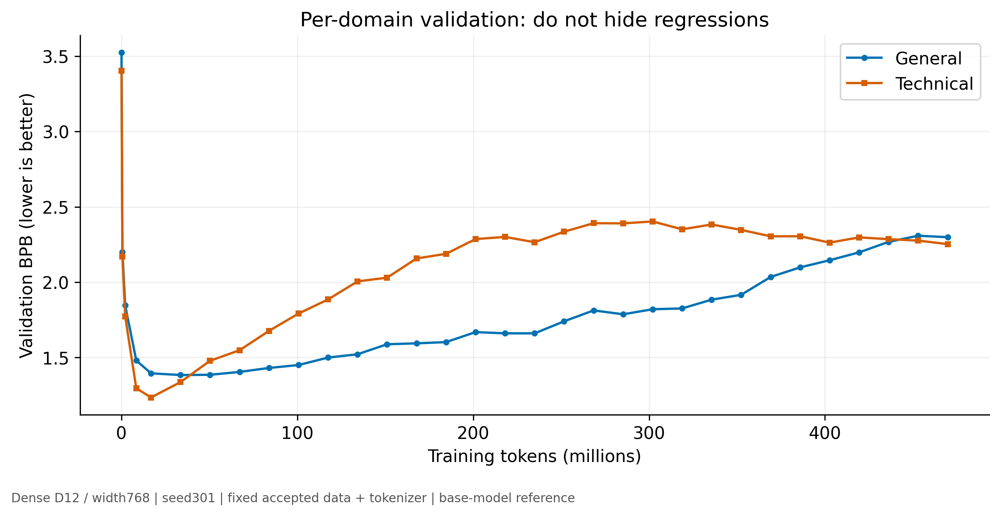
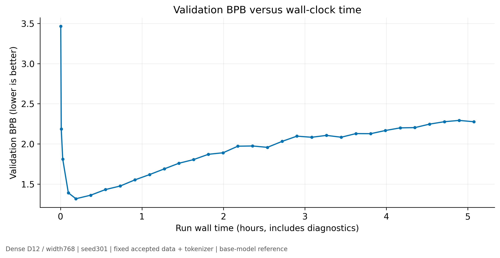
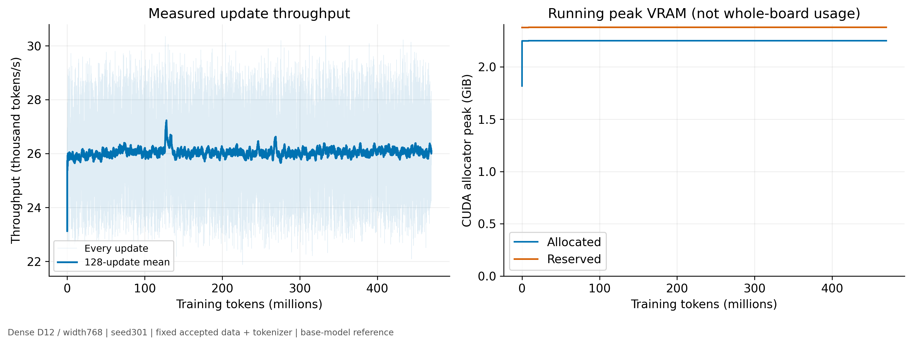
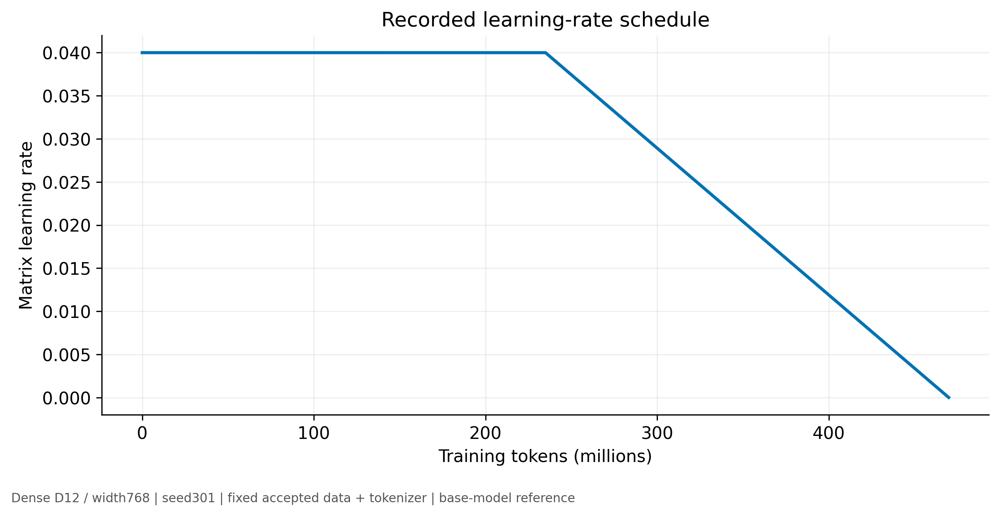
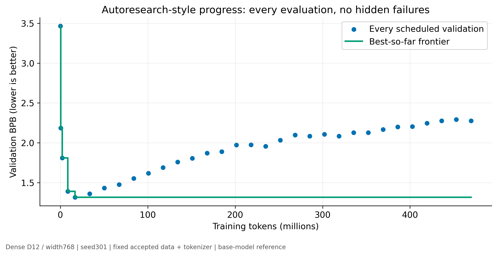

# Long-run dense reference baseline

**The long run overfit this fixed validation set: endpoint BPB regressed more than 0.02 from its best despite continued optimization.**

## Verified facts

- Fresh initialization, predeclared seed 301. Accepted foundation-general-v2 architecture, tokenizer, corpus and 80/20 mixture retained. No architecture search, alternative tokenizer, mixture or mechanism.
- **135,267,480 total and structurally active parameters**; external memory table **0 bytes**. Active counts include full shared embedding tables, not measured per-token FLOPs.
- Completed **469,762,048 tokens**, **3.4728 tokens/parameter**, **28,672 updates**. 32 scheduled validation points. Test evaluated once on the final fixed-budget checkpoint.
- Training revision `fd5dfd607900c32a4e65f1f58e8ba011e741a99f`. Exact config and identities: [baseline reference](baseline-reference.json), [checkpoint manifest](checkpoint-manifest.json).

## Measurements

| Metric | General | Technical | Aggregate |
|---|---:|---:|---:|
| Final validation BPB | 2.298674 | 2.252582 | 2.276089 |
| Final test BPB | 2.461218 | 2.314409 | 2.397324 |

**Lower BPB is better.** The test is the fixed foundation regression set, not a newly untouched benchmark.

| Comparison with direct joint accepted-pilot mean (seeds211/212/213) | BPB change | Percentage change |
|---|---:|---:|
| matched_tokens_validation | +0.113011 | +8.85% |
| final_validation | +0.998904 | +78.21% |
| final_test | +1.062078 | +79.54% |

| Final comparison by domain | General BPB change (%) | Technical BPB change (%) |
|---|---:|---:|
| final_validation | +0.916817 (+66.35%) | +1.084345 (+92.82%) |
| final_test | +1.024438 (+71.30%) | +1.110924 (+92.31%) |

These are descriptive comparisons, not paired superiority claims. The 8,388,608-token checkpoint matches token count but not seed or schedule history. Prior tokenizer and pool gains are **not added together**. Per-domain absolute and percentage comparisons are in the reference JSON.

Measured training-update time: **5.025h**; trainer wall **5.077h**; supervised wall including process startup/exit **5.078h**. Throughput **25,968tok/s** over all updates; steady **25,968tok/s**. Allocator peaks **2304.7MiB allocated /2436.0MiB reserved**.

Evaluation time **64.2s**; checkpoint saves **58.0s**; milestone generation **14.9s**. Maximum sampled temperature **63°C**; sampled whole-board memory max **4209MiB**; mean sampled GPU utilization **60.7%** (startup and diagnostics included; samples are not exact board peaks).

Actual domain passes: general **37.619**, technical **67.805**. The pool has 11,378,155 one-pass token positions including BOS, not 469M unique tokens. Full-model preflight/calibration work is separately retained; it is not part of the reference's token budget.

## Learning curve and inferences

Training cross-entropy averaged **3.393056 nats/token** over the 128 updates ending at the best validation point, versus **0.207372** over the final 128 updates. Its decline did not translate into held-out improvement. Train CE and validation BPB use different units; these values are not subtracted to manufacture a gap.

Best recorded validation: **1.316541BPB**, step **1024**, **16,777,216tokens**. Endpoint gap from best: **+0.959549BPB**. Final-quarter aggregate gain: **-0.148858BPB**.
Domain endpoint gaps from their own best observations: general **+0.914957**, technical **+1.017777BPB**.
Improvement already slowed from **0.066766BPB per million tokens** over2.10M–8.39Mtokens to **0.008780BPB per million** over8.39M–16.78M. The full curve records subsequent regressions as well as recoveries.
First three consecutive1024-update intervals each gaining less than0.01BPB begin at **33,554,432tokens**. This descriptive slowing criterion is not a stopping rule or confidence interval.
Token exposure and the original budget-relative LR/weight-decay schedule change together. Late gains cannot be attributed solely to more tokens. The repeated small pool is a plausible contributor to overfitting, not an isolated causal finding; schedule/hyperparameter effects were not ablated. Repeated-data overfitting and insufficient unique data can coexist; this is not evidence of broad assistant capability.

## Charts and underlying data

[All chart data](chart-data/) retains every update and validation. [Full validation history](validation-history.json) and [raw GPU samples](gpu-health.json) are also retained. GPU samples are ordered, roughly five seconds apart; exact per-sample timestamps were not recorded. Re-rendering requires no training. SVG and 300 DPI PNG versions are included.









## Qualitative sample observations

Fixed six prompts, seed 20260915, top-k 40, temperature 0.8 and 64 generated tokens; samples at 8.39M, 234.88M and 469.76M tokens. Prose, factual-looking text, code, mathematics and instruction-like text are included. Base model, no instruction tuning. See [sample inspection](SAMPLES.md); syntax and repetition observations are not functional or factual accuracy claims.

## Failures, interruptions and limitations

Reference attempts: **1**; discarded/replayed successful-update tokens: **0**. Failed-attempt logs are preserved. One seed cannot establish superiority or bound long-run seed variance.
The initial strict resume trajectory comparison failed. Independent uninterrupted BF16 repeats also diverged. Exact restoration of model/optimizer/RNG/sampler was then verified before continuation; four-step continuation loss/BPB differences were below 0.0001. That short-test tolerance is not a full-run reproducibility bound. No kernel or optimizer policy was changed to force matching.
Final validation fresh-process replay difference: **0BPB**; weights unchanged. Final checkpoint was loaded and used for fresh-process generation.

## Work not completed

- No multi-seed long-run comparison, broad capability benchmark or 8GB-card deployment measurement.
- No new sources, architecture search, optimizer tuning, alternate mixture/tokenizer or production-weight promotion.
- No proof of semantic/external-benchmark decontamination. No claim that hundreds of millions of repeated tokens equal that much unique training data.

## Exact reference for the next adaptive campaign

Primary fixed-budget anchor: **2.276089validation BPB** at **469,762,048tokens**, with the per-domain targets above and **5.078h supervised wall** on the recorded runtime. The complete best-so-far frontier is also a reference: do not claim a gain by comparing a selected cheap checkpoint only with an inferior endpoint. Compare matched-token and matched-wall tracks separately; record total/active parameters, table size and memory costs. Never optimize against the opened test scores.

The accepted direct joint pilot mean remains **1.277185validation BPB at8,388,608tokens**. This reference campaign does not automatically replace it with a stronger model. A next campaign must not claim progress merely by beating a degraded long-run endpoint while failing the cheaper accepted pilot or the recorded frontier.

## Next three highest-value actions

1. Use this frozen configuration/frontier as the adaptive control; confirm small gains with matched fresh-seed controls rather than treating this one seed as a superiority distribution.
2. Prioritize a separately declared unique-data expansion with new held-out evidence if repetition/plateau dominates; do not silently change this reference pool.
3. Add bounded task-level evaluations before claiming useful code, mathematics, instruction-following or factual accuracy.

## Reproduction and inference

The original run directory must not be overwritten. Training/resume are for recovery or a separately named replication, not a request to restart the completed campaign. See [protocol](../../docs/foundation-long-v1.md) for calibration, source locks and resume limitations.

```powershell
$py = '.autoresearch/upstream/.venv/Scripts/python.exe'
& $py scripts/long_baseline_campaign.py train --config experiments/mainline/foundation-long-v1.json
# Recovery only, same frozen config and source bytes:
& $py scripts/supervise_long_resume.py --config experiments/mainline/foundation-long-v1.json --run runs/foundation_long_20260916/reference --deadline "2026-09-16T12:46:33.205990-04:00"
# Final evaluation command used ONCE (will refuse a second test opening):
& $py scripts/evaluate_long_baseline.py --run runs/foundation_long_20260916/reference --mode finalize --output runs/foundation_long_20260916/final-evaluation
# Rebuild all charts solely from committed numeric data:
& $py scripts/chart_long_baseline.py --data reports/foundation-long-v1/chart-data --output reports/foundation-long-v1/charts
# Load final checkpoint in a fresh process and generate fixed diagnostic samples:
& $py scripts/evaluate_long_baseline.py --run runs/foundation_long_20260916/reference --checkpoint runs/foundation_long_20260916/reference/checkpoint-028672.pt --mode generate --output runs/foundation_long_20260916/manual-generation-01.json
```

Large checkpoints, raw corpora and cached shards remain outside Git. Checkpoint locations and SHA256 hashes are in the manifest. See [closeout](CLOSEOUT.md) for clocks, focused tests, independent audits and publication details.
